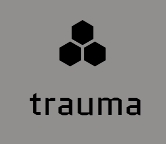
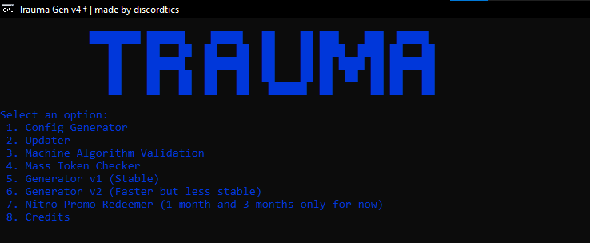

[![Contributors][contributors-shield]][contributors-url]
[![Forks][forks-shield]][forks-url]
[![Stargazers][stars-shield]][stars-url]
[![Issues][issues-shield]][issues-url]
[![MIT License][license-shield]][license-url]
[![LinkedIn][linkedin-shield]][linkedin-url]


<br />
<div align="center">
  <a href="">
    
  </a>

  <h3 align="center">discord token-generator V5</h3>

  <p align="center">
     Advanced Captcha Solving with Artificial Intelligence
    <br />
    <a href="https://github.com/tr7ma/token-gen"><strong>Explore the docs »</strong></a>
    <br />
    <br />
    <a href="https://github.com/tr7ma/token-gen">View Demo</a>
    ·
    <a href="https://github.com/tr7ma/token-gen">Report Bug</a>
    ·
    <a href=https://github.com/tr7ma/token-gen">Request Feature</a>
  </p>
</div>


# TOKEN GEN

Unlock the potential of cutting-edge AI technology for captcha solving with TOKEN-GEN AI.



## Installation Instructions

# auto installation and setup ( easier )

1. * download the repository or clone using
  ```sh
  git clone https://github.com/tr7ma/token-gen.git
  ```
2.   * run the ```setup.bat``` file
  
     * this will install everything you need

*you dont have to edit any files or update anything if youre using this method, its easier and less complex and it'll ask you     for the required inputs eventually*


### Manual Configuration.

1. Open your terminal. and
   * clone
  ```sh
  git clone https://github.com/tr7ma/token-gen.git
  ```
   * or download the zip
3.   * navigate to dir
   ```sh
    cd token-gen
  ```
3.   * install dependencies
   ```sh
    pip install -r requirements.txt
  ``` 
4.   * run the script
   ```sh
    python main.py
  ```

## System Requirements

Ensure your system meets these prerequisites:

1. Python 9+ (the latest version is recommended for optimal performance).
2. git installed on your device
3. Windows 10 or 11.
4. A curious mind.

# specifications

1. bypasses captchas and locks with fingerprints , api manipulation and TCP swappers
2. auto scrapes proxies from multiple sources accross the web but i reccomend using own proxies
3. good maintainance

> Note: As of nov  june 11th , 2024,TRAUMA TOKEN GEN is fully operational. We will promptly update if any patches become necessary. Remember, sharing knowledge benefits everyone; please provide credit if you find our work valuable.

> To aspiring developers: This source code is generously shared to facilitate understanding of machine learning in captcha-solving—an outcome of our dedication and hard work.


[contributors-shield]: https://img.shields.io/github/contributors/tr7ma/token-gen.svg?style=for-the-badge
[contributors-url]: https://github.com/tr7ma/token-gen/graphs/contributors
[forks-shield]: https://img.shields.io/github/forks/tr7ma/token-gen.svg?style=for-the-badge
[forks-url]: https://github.com/tr7ma/token-gen/network/members
[stars-shield]: https://img.shields.io/github/stars/tr7ma/token-gen.svg?style=for-the-badge
[stars-url]: https://github.com/tr7ma/token-gen/stargazers
[issues-shield]: https://img.shields.io/github/issues/tr7ma/token-gen.svg?style=for-the-badge
[issues-url]: https://github.com/tr7ma/token-gen/issues
[license-shield]: https://img.shields.io/github/license/tr7ma/token-gen.svg?style=for-the-badge
[license-url]: https://github.com/tr7ma/token-gen/blob/master/LICENSE.txt
[linkedin-shield]: https://img.shields.io/badge/-LinkedIn-black.svg?style=for-the-badge&logo=linkedin&colorB=555
[linkedin-url]: https://linkedin.com/in/othneildrew
[product-screenshot]: images/screenshot.png
[Next.js]: https://img.shields.io/badge/next.js-000000?style=for-the-badge&logo=nextdotjs&logoColor=white
[Next-url]: https://nextjs.org/
[React.js]: https://img.shields.io/badge/React-20232A?style=for-the-badge&logo=react&logoColor=61DAFB
[React-url]: https://reactjs.org/
[Vue.js]: https://img.shields.io/badge/Vue.js-35495E?style=for-the-badge&logo=vuedotjs&logoColor=4FC08D
[Vue-url]: https://vuejs.org/


Your support fuels our dedication to furthering the boundaries of AI and cryptography. 

